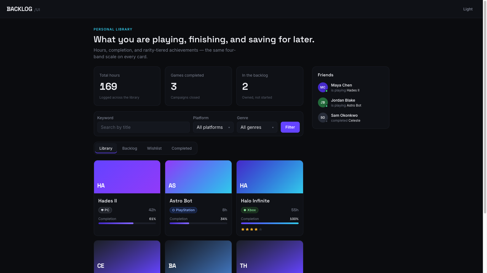
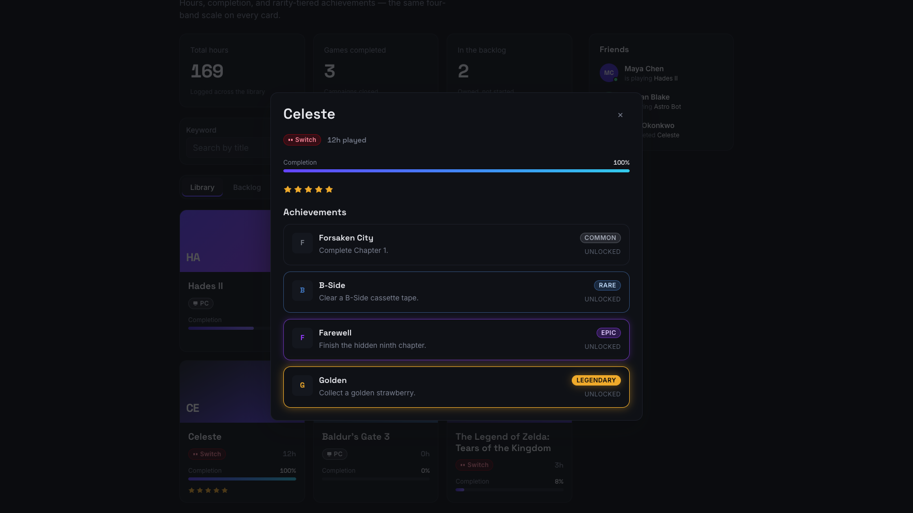
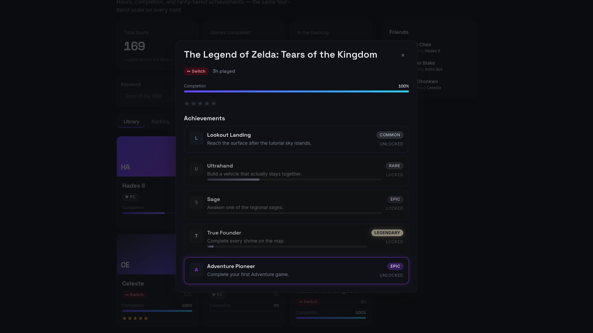

# BACKLOG/UI

A hand-built React design system and a game-library dashboard that consumes it. No Tailwind, no shadcn, no component kit — tokens, CSS modules, and original components end to end.

**Live demo:** deploy with `npx vercel` (or Netlify) and put the URL here.



## Two parts

| Folder                      | What it is                                                                                                                                  |
| --------------------------- | ------------------------------------------------------------------------------------------------------------------------------------------- |
| `src/design-system/`        | **BACKLOG/UI** — the public component API. Tokens, primitives, and game-specific pieces. Import from `src/design-system/index.ts`.          |
| `src/app/features/backlog/` | **Backlog** — a personal library for tracking what you play, finish, and save. It only talks to the design system through that barrel file. |

The system is the portfolio piece. The app exists to prove the system holds up in a real layout: filters, tabs, a grid, a focus-trapped modal, and toasts.

## Token architecture

Dark is the default. Palette ramps live on `:root`; `[data-theme="light"]` remaps semantic tokens (`--color-bg`, `--color-text`, `--color-border`), not the raw violets and golds.

The load-bearing decision is the **rarity scale**. Achievements have four named bands — the same way a chess rating has floors, or a marketplace listing has a category. Components derive color from the band. Callers pass `rarity="legendary"`, never a hex.

| Token                | Role                                                                 |
| -------------------- | -------------------------------------------------------------------- |
| `--rarity-common`    | Gray. Floor of the scale.                                            |
| `--rarity-rare`      | Blue.                                                                |
| `--rarity-epic`      | Purple, with a light glow when unlocked.                             |
| `--rarity-legendary` | Gold (`--gold-500`). Glow is part of the token, not an afterthought. |

`RarityBadge` and the accent border on `AchievementCard` both read that scale. Locked achievements desaturate and drop the glow so rarity stays meaningful.

Other tokens:

- **Primary:** `--violet-600`, with cyan used sparingly (completed progress fills).
- **Type:** Space Grotesk for titles and numbers, Inter for UI copy. Hours and percents use `font-variant-numeric: tabular-nums` so a grid of `GameCard`s does not jitter.
- **Space:** 4px base, 4–64px. Radii: sm / md / lg / full.





## Run it

```bash
npm install
npm run dev      # http://localhost:5173
npm run test
npm run lint
npm run build
```

Stack: Vite, React 18, TypeScript (`strict`), plain CSS modules, Vitest + Testing Library, ESLint + Prettier.

State lives in `useGames` and persists to `localStorage`. Seed data covers all four platforms and all four statuses so every tab has content on first load. Marking a game completed fires a toast; the first completed title in a genre unlocks an extra achievement notification.

## GitHub extras

After the repo is up:

```bash
gh repo edit --add-topic design-system --add-topic react --add-topic typescript --add-topic component-library
gh repo edit --description "Hand-built BACKLOG/UI design system and a game-library dashboard."
```

MIT licensed. Pin it from your GitHub profile if you want it on the front page — that is a profile setting, not a repo file.
